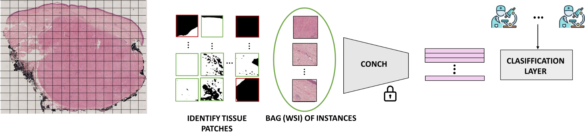

# A Fusocelular Skin Dataset with Whole Slide Images for Deep Learning Models

### Code for replicating the results of the paper [A Fusocelular Skin Dataset with Whole Slide Images for Deep Learning Models](https://doi.org/10.1038/s41597-025-05108-3)
Find the related publication with DOI: https://doi.org/10.1038/s41597-025-05108-3.
#### Citation
~~~
@article{del2025fusocelular,
  title={A fusocelular skin dataset with whole slide images for deep learning models},
  author={Del Amor, Roc{\'\i}o and L{\'o}pez-P{\'e}rez, Miguel and Meseguer, Pablo and Morales, Sandra and Terradez, Liria and Aneiros-Fernandez, Jose and Mateos, Javier and Molina, Rafael and Naranjo, Valery},
  journal={Scientific Data},
  volume={12},
  number={788},
  year={2025},
  publisher={Nature Publishing Group}
}
~~~

## Abstract
Cutaneous spindle cell (CSC) lesions range from benign to malignant tumors, leading to diagnostic challenges. This work introduces AI4SkIN, the first public dataset for CSC neoplasms, annotated using an innovative crowdsourcing protocol. AI4SkIN dataset contains 641 Hematoxylin and Eosin (H\&E) stained Whole Slide Images (WSIs) with multiclass labels from both expert and trainee pathologists. This dataset aims to enhance the diagnosis and classification of CSC neoplasms through advanced machine-learning methods. Validated with state-of-the-art crowdsourcing techniques based on Gaussian Processes (GPs), AI4SkIN provides a good resource for multiclass CSC neoplasm classification.

 ## Description of the repo
 This repo contains the code used for the paper "A Fusocelular Skin Dataset with Whole Slide Images for Deep Learning Models". We include all the scripts for classification and the feature embeddings of the WSIs.
  Run the main.py file in the src folder. Remember to download the embeddings and labels and adjust the paths.
  
## Data source

The data used is available at Figshare: https://doi.org/10.6084/m9.figshare.27118035.

The processed files (embeddings, partitions, and labels) to replicate the experiment of the current repo can be found on the following [link](https://drive.google.com/file/d/1B3j183eEn5dpl-Evf1GEPDuxwT9aGf4t/view?usp=drive_link).

## DEMO
### Install dependencies

~~~
$ conda install gpflow=1.2.0
$ python src/main.py
~~~
